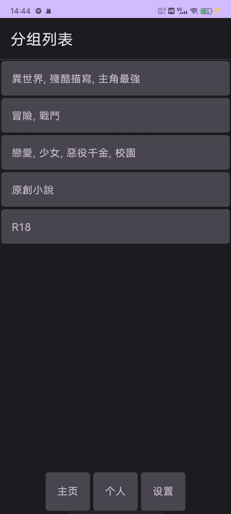
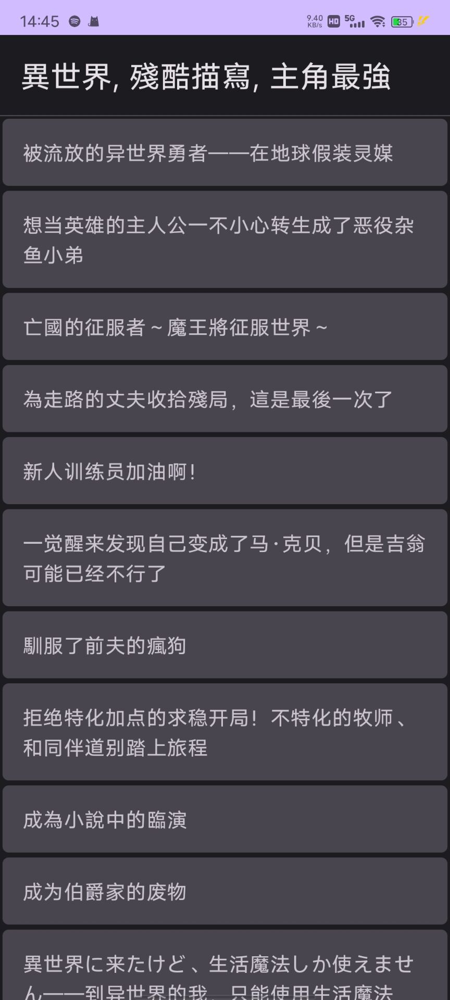
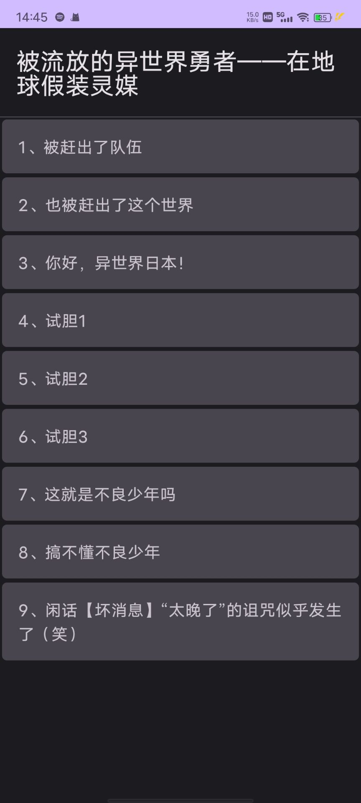
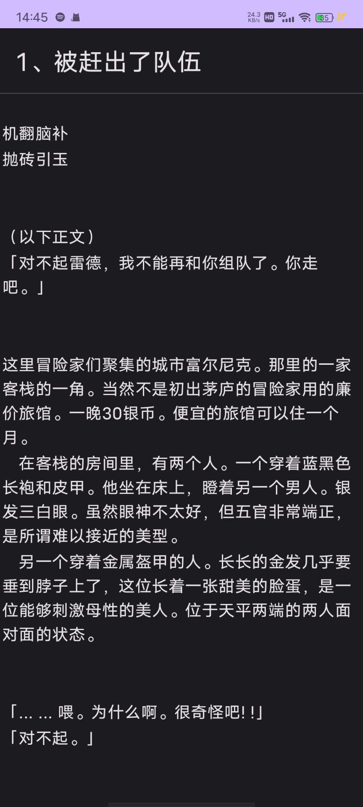

# Esj Zone Client
非官方的Esj Zone安卓客户端

**注意：目前该软件仍在开发中，所以极其的不稳定，准确来说都无法正常使用**

## 待办事项
- 小说详细页显示更多信息，评论功能
- 返回（没错，因为这是我第一次开发Android，而且用的还是compose，我连返回功能都不会实现）
- 本地历史记录，本地收藏
- 下载、缓存功能
- 离线时可以浏览已经下载或缓存的内容
- 更好的观看体验（可能会找一下开源的阅读控件）
- 更好的底边栏（就是登录后进入主页，下面三个按钮“主页” “个人” “设置”
- 支持注册账号（现在你只能在官网注册完账号然后再来登录）
- UI全部进行一遍优化处理

## 给用户的小建议
建议大家注册个复杂一点的密码，准确来说是建议大家为esjzone注册一个单独的密码，因为esj的密码是 **明！文！存！储！** 的，我上次忘了密码点击忘记密码，结果他们直接把之前的密码发到我邮箱里了

esj目测前后端一半分离一半没有，反正网站做的依托答辩，我做这个软件我还得用xpath解析html而不是直接调用api

## 贡献
嘛，我写的太烂了，要是有大佬愿意帮帮忙，我当然是欢迎的啦！

## 截图展示

